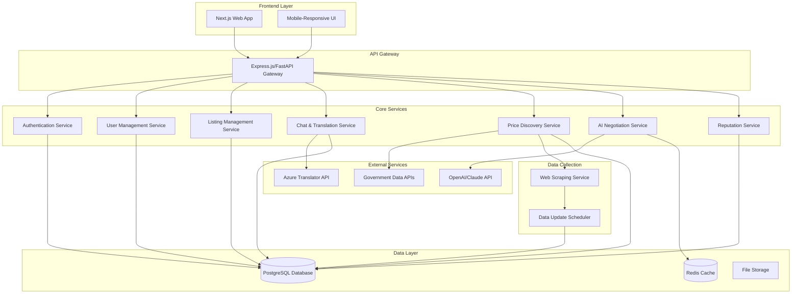

# Design Document: Marketplace Mandi

## Overview

Marketplace Mandi is a multilingual AI-powered marketplace platform that bridges language and economic barriers in Indian local trade. The system combines real-time translation, intelligent price discovery, and AI-assisted negotiation to create a comprehensive trading platform for farmers, wholesalers, and small business owners.

The platform operates as a web-first application with mobile-responsive design, supporting 22 Indian languages and focusing exclusively on physical goods trading within India.

## Architecture

### High-Level Architecture



### Technology Stack

**Frontend:**
- Next.js 14 with React 18
- Tailwind CSS for styling
- next-i18next for internationalization
- React Query for state management
- Socket.io-client for real-time chat

**Backend:**
- Node.js with Express.js (or Python with FastAPI)
- Socket.io for real-time communication
- PostgreSQL for primary data storage
- Redis for caching and session management
- Bull Queue for background job processing

**External Integrations:**
- Azure Translator API for multilingual support
- OpenAI GPT-4 or Claude for AI negotiation
- Government APIs for MSP/mandi data
- Web scraping services for marketplace data

## Components and Interfaces

### 1. Authentication and User Management

**User Registration Component:**
```typescript
interface UserRegistrationData {
  name: string;
  phoneNumber: string;
  location: {
    state: string;
    district: string;
    pincode: string;
  };
  preferredLanguage: SupportedLanguage;
  userType: 'buyer' | 'seller' | 'both';
}

interface UserProfile {
  id: string;
  name: string;
  phoneNumber: string;
  location: Location;
  preferredLanguage: SupportedLanguage;
  userType: UserType;
  reputationScore: number;
  isVerified: boolean;
  createdAt: Date;
  lastActive: Date;
}
```

**Authentication Service:**
- JWT-based authentication
- Phone number verification via OTP
- Session management with Redis
- Role-based access control

### 2. Multilingual Translation System

**Translation Service Interface:**
```typescript
interface TranslationService {
  translateMessage(
    text: string,
    fromLanguage: SupportedLanguage,
    toLanguage: SupportedLanguage
  ): Promise<TranslationResult>;
  
  detectLanguage(text: string): Promise<SupportedLanguage>;
  
  translateBulk(
    messages: Message[],
    targetLanguage: SupportedLanguage
  ): Promise<TranslatedMessage[]>;
}

interface TranslationResult {
  translatedText: string;
  confidence: number;
  detectedLanguage?: SupportedLanguage;
  error?: string;
}

interface Message {
  id: string;
  senderId: string;
  receiverId: string;
  originalText: string;
  originalLanguage: SupportedLanguage;
  timestamp: Date;
  chatId: string;
}

interface TranslatedMessage extends Message {
  translatedText: string;
  targetLanguage: SupportedLanguage;
  translationConfidence: number;
}
```

**Supported Languages Enum:**
```typescript
enum SupportedLanguage {
  ASSAMESE = 'as',
  BENGALI = 'bn',
  BODO = 'brx',
  DOGRI = 'doi',
  GUJARATI = 'gu',
  HINDI = 'hi',
  KANNADA = 'kn',
  KASHMIRI = 'ks',
  KONKANI = 'gom',
  MAITHILI = 'mai',
  MALAYALAM = 'ml',
  MANIPURI = 'mni',
  MARATHI = 'mr',
  NEPALI = 'ne',
  ODIA = 'or',
  PUNJABI = 'pa',
  SANSKRIT = 'sa',
  SANTALI = 'sat',
  SINDHI = 'sd',
  TAMIL = 'ta',
  TELUGU = 'te',
  URDU = 'ur'
}
```

### 3. Product Listing Management

**Listing Data Models:**
```typescript
interface ProductListing {
  id: string;
  sellerId: string;
  productName: string;
  category: ProductCategory;
  description: string;
  quantity: {
    amount: number;
    unit: string;
  };
  askingPrice: {
    amount: number;
    currency: 'INR';
    unit: string; // per kg, per piece, etc.
  };
  location: Location;
  images: string[];
  language: SupportedLanguage;
  status: 'active' | 'sold' | 'expired' | 'draft';
  createdAt: Date;
  updatedAt: Date;
  expiresAt: Date;
}

interface ProductCategory {
  id: string;
  name: string;
  parentId?: string;
  subcategories?: ProductCategory[];
}

interface Location {
  state: string;
  district: string;
  pincode: string;
  coordinates?: {
    latitude: number;
    longitude: number;
  };
}
```

**Listing Service Interface:**
```typescript
interface ListingService {
  createListing(listing: CreateListingRequest): Promise<ProductListing>;
  updateListing(id: string, updates: UpdateListingRequest): Promise<ProductListing>;
  deleteListing(id: string, sellerId: string): Promise<void>;
  searchListings(criteria: SearchCriteria): Promise<SearchResult>;
  getListingById(id: string): Promise<ProductListing>;
  getSellerListings(sellerId: string): Promise<ProductListing[]>;
}
```

### 4. Price Discovery Engine

**Price Discovery Service:**
```typescript
interface PriceDiscoveryService {
  getPriceInsights(
    productName: string,
    category: string,
    location: Location
  ): Promise<PriceInsights>;
  
  updatePriceData(): Promise<void>;
  getMarketTrend(productName: string): Promise<MarketTrend>;
}

interface PriceInsights {
  suggestedPriceRange: {
    min: number;
    max: number;
    currency: 'INR';
    unit: string;
  };
  marketTrend: 'rising' | 'falling' | 'stable';
  confidenceScore: number; // 0-1
  dataSources: PriceDataSource[];
  lastUpdated: Date;
  dataFreshness: 'fresh' | 'stale' | 'outdated';
}

interface PriceDataSource {
  source: 'government' | 'marketplace' | 'user_listings' | 'historical';
  name: string;
  price: number;
  timestamp: Date;
  confidence: number;
}

interface MarketTrend {
  direction: 'rising' | 'falling' | 'stable';
  percentage: number;
  timeframe: string;
  confidence: number;
}
```

**Data Collection Architecture:**
- Government API integration for MSP and mandi prices
- Web scraping service for IndiaMART, Amazon, Flipkart
- User listing aggregation and analysis
- Historical price trend calculation
- Confidence scoring based on data quality and freshness

### 5. AI Negotiation Assistant

**AI Negotiation Service:**
```typescript
interface AINegotiationService {
  analyzeNegotiation(
    chatHistory: Message[],
    currentOffer: number,
    marketPrice: PriceInsights,
    userReputations: { buyer: number; seller: number }
  ): Promise<NegotiationAnalysis>;
  
  suggestCounterOffer(
    analysis: NegotiationAnalysis,
    userRole: 'buyer' | 'seller'
  ): Promise<NegotiationSuggestion>;
  
  analyzeSentiment(message: string): Promise<SentimentAnalysis>;
}

interface NegotiationAnalysis {
  currentPhase: 'opening' | 'bargaining' | 'closing' | 'deadlock';
  sentimentTrend: SentimentAnalysis[];
  priceGap: number;
  negotiationStrength: {
    buyer: number;
    seller: number;
  };
  recommendedStrategy: string;
  riskFactors: string[];
}

interface NegotiationSuggestion {
  suggestedPrice: number;
  reasoning: string;
  confidence: number;
  alternativeOffers: number[];
  negotiationTactics: string[];
  warningFlags: string[];
}

interface SentimentAnalysis {
  sentiment: 'positive' | 'negative' | 'neutral';
  confidence: number;
  emotions: {
    frustration: number;
    eagerness: number;
    hesitation: number;
    satisfaction: number;
  };
  urgencyLevel: number;
}
```

### 6. Real-time Chat System

**Chat Service Interface:**
```typescript
interface ChatService {
  createChat(buyerId: string, sellerId: string, listingId: string): Promise<Chat>;
  sendMessage(chatId: string, senderId: string, message: string): Promise<Message>;
  getChatHistory(chatId: string, userId: string): Promise<TranslatedMessage[]>;
  markDealComplete(chatId: string, userId: string): Promise<Deal>;
}

interface Chat {
  id: string;
  buyerId: string;
  sellerId: string;
  listingId: string;
  status: 'active' | 'completed' | 'cancelled';
  createdAt: Date;
  lastMessageAt: Date;
  dealDetails?: Deal;
}

interface Deal {
  id: string;
  chatId: string;
  agreedPrice: number;
  quantity: number;
  status: 'pending' | 'completed' | 'cancelled';
  completedAt?: Date;
  buyerRating?: number;
  sellerRating?: number;
}
```

### 7. Search and Discovery

**Search Service Interface:**
```typescript
interface SearchService {
  searchProducts(query: SearchQuery): Promise<SearchResult>;
  getRecommendations(userId: string): Promise<ProductListing[]>;
  getPopularCategories(): Promise<CategoryStats[]>;
}

interface SearchQuery {
  text?: string;
  category?: string;
  location?: Location;
  priceRange?: {
    min: number;
    max: number;
  };
  sortBy: 'relevance' | 'price_low' | 'price_high' | 'distance' | 'rating';
  filters: SearchFilters;
  language: SupportedLanguage;
  page: number;
  limit: number;
}

interface SearchResult {
  listings: ProductListing[];
  totalCount: number;
  facets: SearchFacets;
  suggestions: string[];
}
```

## Data Models

### Database Schema

**Users Table:**
```sql
CREATE TABLE users (
  id UUID PRIMARY KEY DEFAULT gen_random_uuid(),
  name VARCHAR(255) NOT NULL,
  phone_number VARCHAR(15) UNIQUE NOT NULL,
  location JSONB NOT NULL,
  preferred_language VARCHAR(10) NOT NULL,
  user_type VARCHAR(20) NOT NULL,
  reputation_score DECIMAL(3,2) DEFAULT 0.00,
  is_verified BOOLEAN DEFAULT FALSE,
  created_at TIMESTAMP DEFAULT NOW(),
  updated_at TIMESTAMP DEFAULT NOW()
);
```

**Product Listings Table:**
```sql
CREATE TABLE product_listings (
  id UUID PRIMARY KEY DEFAULT gen_random_uuid(),
  seller_id UUID REFERENCES users(id),
  product_name VARCHAR(255) NOT NULL,
  category_id UUID REFERENCES categories(id),
  description TEXT,
  quantity JSONB NOT NULL,
  asking_price JSONB NOT NULL,
  location JSONB NOT NULL,
  images TEXT[],
  language VARCHAR(10) NOT NULL,
  status VARCHAR(20) DEFAULT 'active',
  created_at TIMESTAMP DEFAULT NOW(),
  updated_at TIMESTAMP DEFAULT NOW(),
  expires_at TIMESTAMP
);
```

**Messages Table:**
```sql
CREATE TABLE messages (
  id UUID PRIMARY KEY DEFAULT gen_random_uuid(),
  chat_id UUID REFERENCES chats(id),
  sender_id UUID REFERENCES users(id),
  original_text TEXT NOT NULL,
  original_language VARCHAR(10) NOT NULL,
  created_at TIMESTAMP DEFAULT NOW()
);
```

**Price Data Table:**
```sql
CREATE TABLE price_data (
  id UUID PRIMARY KEY DEFAULT gen_random_uuid(),
  product_name VARCHAR(255) NOT NULL,
  category VARCHAR(100),
  price DECIMAL(10,2) NOT NULL,
  unit VARCHAR(50),
  source VARCHAR(50) NOT NULL,
  source_name VARCHAR(255),
  location JSONB,
  confidence_score DECIMAL(3,2),
  collected_at TIMESTAMP DEFAULT NOW(),
  created_at TIMESTAMP DEFAULT NOW()
);
```

### Caching Strategy

**Redis Cache Structure:**
- User sessions: `session:{userId}`
- Translation cache: `translation:{hash(text+fromLang+toLang)}`
- Price insights cache: `price:{productName}:{location}` (TTL: 1 hour)
- AI analysis cache: `ai_analysis:{chatId}:{messageCount}` (TTL: 30 minutes)
- Search results cache: `search:{hash(query)}` (TTL: 15 minutes)

## Correctness Properties

*A property is a characteristic or behavior that should hold true across all valid executions of a system—essentially, a formal statement about what the system should do. Properties serve as the bridge between human-readable specifications and machine-verifiable correctness guarantees.*

Before defining the correctness properties, I need to analyze the acceptance criteria from the requirements document to determine which ones are testable as properties.

### Property 1: User Registration Completeness
*For any* user registration attempt, the system should require all mandatory fields (name, phone, location, preferred language) and create a profile with initial reputation score of zero when all fields are provided.
**Validates: Requirements 1.2, 1.4**

### Property 2: Language Support Universality  
*For any* user interaction (registration, interface display, search), the platform should support all 22 official Indian languages and display content in the user's preferred language.
**Validates: Requirements 1.3, 1.5, 6.1**

### Property 3: Listing Creation with Price Insights
*For any* valid listing creation, the system should require all mandatory fields (product name, category, quantity, location, asking price) and automatically generate price insights upon successful creation.
**Validates: Requirements 2.1, 2.3**

### Property 4: Listing Lifecycle Management
*For any* listing operation (update, delete), the system should preserve creation timestamps during updates and immediately remove deleted listings from search results.
**Validates: Requirements 2.4, 2.5**

### Property 5: Price Discovery Completeness
*For any* price insight generation, the system should incorporate all available data sources (government, marketplace, user listings, historical) and display trend information with confidence scores.
**Validates: Requirements 3.1, 3.2, 3.3**

### Property 6: Data Freshness Handling
*For any* price data display, the system should show freshness warnings for data older than 7 days and clearly indicate insufficient data scenarios instead of showing misleading prices.
**Validates: Requirements 3.4, 3.5**

### Property 7: Translation System Integrity
*For any* chat message, the system should store the original text, provide translations between any supported language pair, and maintain both original and translated versions in message history.
**Validates: Requirements 4.1, 4.2, 4.5**

### Property 8: Translation Error Handling
*For any* translation failure, the system should display the original message with clear error indicators and translation status.
**Validates: Requirements 4.3, 4.4**

### Property 9: AI Negotiation Advisory Constraints
*For any* AI negotiation suggestion, the system should analyze sentiment and provide advice without automatically sending messages, and continue normal operation when suggestions are ignored.
**Validates: Requirements 5.1, 5.3, 5.5**

### Property 10: AI Negotiation Context Awareness
*For any* counter-offer suggestion, the AI should incorporate market trends, user reputation, and negotiation history in its recommendations.
**Validates: Requirements 5.2**

### Property 11: Search Functionality Completeness
*For any* search operation, the system should support text search in the user's language, display complete result information (name, price, location, reputation), and provide all specified filters (category, location, price range, rating).
**Validates: Requirements 6.2, 6.3**

### Property 12: Search Result Prioritization
*For any* search results display, listings should be ordered by relevance, proximity, and seller reputation according to the specified ranking algorithm.
**Validates: Requirements 6.5**

### Property 13: Reputation System Consistency
*For any* completed deal, the system should prompt both parties for ratings, weight recent ratings more heavily in calculations, and update reputation scores based on transaction outcomes.
**Validates: Requirements 7.1, 7.2, 10.4**

### Property 14: Seller Profile Completeness
*For any* seller profile display, the system should show overall rating, number of completed deals, verified status, and award verified badges to consistently high-rated sellers.
**Validates: Requirements 7.3, 7.4**

### Property 15: AI Reputation Integration
*For any* AI negotiation strategy, the system should factor user reputation levels into the generated advice and suggestions.
**Validates: Requirements 7.5**

### Property 16: Data Collection Reliability
*For any* data collection cycle, the system should fetch government data daily, scrape marketplace data while respecting rate limits, and validate data quality with confidence scoring.
**Validates: Requirements 8.1, 8.2, 8.3**

### Property 17: Data Storage Metadata Completeness
*For any* stored price data, the system should include source attribution, timestamp, and confidence metadata for traceability and quality assessment.
**Validates: Requirements 8.5**

### Property 18: System Resilience
*For any* data source unavailability, the system should continue operating with cached data and display appropriate freshness warnings.
**Validates: Requirements 8.4**

### Property 19: Mobile Functionality Parity
*For any* platform feature, mobile devices should provide full functionality with touch-optimized controls and minimal steps for common tasks.
**Validates: Requirements 9.1, 9.3**

### Property 20: Form Validation Clarity
*For any* form interaction, the system should provide clear validation feedback and error messages for user guidance.
**Validates: Requirements 9.4**

### Property 21: Deal Management Completeness
*For any* deal agreement, the system should provide confirmation interfaces, maintain complete negotiation history, and display comprehensive transaction details in user deal histories.
**Validates: Requirements 10.1, 10.3, 10.5**

## Error Handling

### Translation Service Errors
- **Network failures**: Graceful degradation to original language display
- **Unsupported language pairs**: Clear error messaging with fallback options
- **API rate limiting**: Queue management with user notification
- **Translation confidence low**: Warning indicators with original text display

### Price Discovery Errors
- **Data source unavailable**: Cache utilization with staleness indicators
- **Insufficient data**: Clear messaging about data limitations
- **Calculation failures**: Fallback to basic price ranges with reduced confidence
- **API timeouts**: Cached results with appropriate warnings

### AI Service Errors
- **LLM API failures**: Disable AI suggestions with clear user notification
- **Sentiment analysis errors**: Continue without sentiment-based recommendations
- **Context processing failures**: Provide basic negotiation templates
- **Rate limiting**: Queue requests with user feedback

### Database and Infrastructure Errors
- **Connection failures**: Graceful degradation with cached data
- **Query timeouts**: Retry logic with exponential backoff
- **Storage failures**: Error logging with user notification
- **Cache misses**: Direct database fallback

### User Input Validation
- **Invalid phone numbers**: Format validation with correction suggestions
- **Incomplete registrations**: Field-specific error messaging
- **Invalid listing data**: Comprehensive validation with helpful guidance
- **File upload errors**: Size and format validation with clear limits

## Testing Strategy

### Dual Testing Approach

The testing strategy employs both unit testing and property-based testing to ensure comprehensive coverage:

**Unit Tests**: Focus on specific examples, edge cases, and error conditions including:
- Specific language translation pairs
- Known price calculation scenarios  
- Integration points between services
- Error handling for specific failure modes
- UI component behavior with sample data

**Property Tests**: Verify universal properties across all inputs including:
- All 22 language combinations for translation
- Price calculation consistency across different data inputs
- User registration validation across various input combinations
- Search functionality across different query types
- AI negotiation behavior across different conversation contexts

### Property-Based Testing Configuration

**Testing Framework**: Jest with fast-check for JavaScript/TypeScript implementation
- Minimum 100 iterations per property test to ensure statistical confidence
- Each property test references its corresponding design document property
- Tag format: **Feature: marketplace-mandi, Property {number}: {property_text}**

**Test Data Generation**:
- User profiles with randomized valid/invalid field combinations
- Product listings across all supported categories and languages
- Chat conversations with varied sentiment and negotiation patterns
- Price data with different freshness levels and confidence scores
- Search queries in all supported languages with various filter combinations

**Property Test Examples**:
```javascript
// Feature: marketplace-mandi, Property 1: User Registration Completeness
test('user registration requires all mandatory fields', () => {
  fc.assert(fc.property(
    fc.record({
      name: fc.string(),
      phone: fc.string(),
      location: fc.record({...}),
      language: fc.constantFrom(...supportedLanguages)
    }),
    (userData) => {
      const result = registerUser(userData);
      return result.success && result.user.reputationScore === 0;
    }
  ), { numRuns: 100 });
});
```

**Integration Testing**:
- End-to-end user workflows from registration to deal completion
- Cross-service communication validation
- External API integration reliability
- Real-time chat and translation functionality
- Mobile responsiveness across different devices and screen sizes

**Performance Testing**:
- Translation service response times under load
- Price discovery calculation performance with large datasets
- Search response times with extensive product catalogs
- Concurrent user chat performance
- Database query optimization validation

### Test Environment Setup

**Development Environment**:
- Local PostgreSQL and Redis instances
- Mock external APIs (Azure Translator, OpenAI, Government APIs)
- Seed data for all 22 supported languages
- Sample product catalogs across different categories
- Test user accounts with various reputation levels

**Continuous Integration**:
- Automated test execution on code changes
- Property test failure analysis and reporting
- Performance regression detection
- Translation accuracy validation
- Mobile compatibility testing

The testing strategy ensures that both specific scenarios and universal behaviors are validated, providing confidence in the system's correctness across the wide variety of inputs and use cases expected in a multilingual marketplace platform.